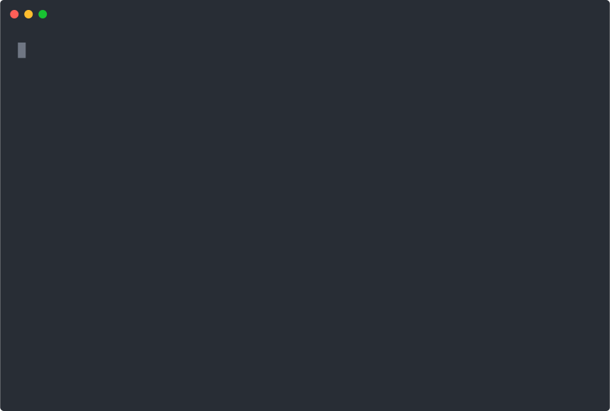

# The `out` Module: Output and Styling

The `out` module in CliFire simplifies printing messages to the terminal in various styles and colors by harnessing the power of the [Rich library](https://rich.readthedocs.io/). With these functions, you can display information, warnings, errors, success messages, debug outputs, and even live updates.

## Main Functions

Import the `out` module into your application as follows:

```python
from clifire import out
```

Below are the most commonly used functions:

- **`out.info(text: str) -> None`**
  Displays an informational message.
  ```python
  out.info("This is an informational message")
  ```

- **`out.success(text: str) -> None`**
  Displays a success message, perfect for indicating that an operation completed successfully.
  ```python
  out.success("Operation completed successfully")
  ```

- **`out.warn(text: str) -> None`**
  Prints a warning message, useful when caution is required during execution.
  ```python
  out.warn("Warning: check your configuration")
  ```

- **`out.error(text: str) -> None`**
  Displays an error message prominently to signal critical failures in the process.
  ```python
  out.error("Critical error occurred")
  ```

- **`out.debug(text: str) -> None`**
  Prints debug messages, which are useful during development to trace internal behavior.
  ```python
  out.debug("Debug: variable x = 42")
  ```

- **`out.var_dump(var) -> None`**
  Prints the contents of a variable in a human-readable format, highlighting its structure to aid in inspection.
  ```python
  sample_dict = {"key": "value", "numbers": [1, 2, 3]}
  out.var_dump(sample_dict)
  ```

- **`out.LiveText`**
  This is a class that allows you to update text in real time in the terminal. It is useful for displaying progress bars or counters that update dynamically.
  ```python
  live_text = out.LiveText("Starting...")
  live_text.info("Process running")
  live_text.warn("Retrying operation")
  live_text.success("Operation completed", end=False)
  ```

## General Usage

The `out` module is designed to integrate seamlessly with your commands and applications built with CliFire, providing a standardized and stylized output format for the terminal. Each function applies predefined styles to ensure a consistent and appealing user experience.

Below is a complete example:

```python
import time

from clifire import application, command, out


class OutCommand(command.Command):
    _name = 'out'

    def fire(self):
        print('Text colors')
        print('-' * 80)
        out.info("This is an informational message")
        out.success("Operation completed successfully")
        out.warn("Warning: check your configuration")
        out.error("Critical error occurred")

        print('')
        print('Debug')
        print('-' * 80)
        out.debug("Debug: variable x = 42")
        sample_dict = {"key": "value", "numbers": [1, 2, 3]}
        out.var_dump(sample_dict)

        print('')
        print('Tables')
        print('-' * 80)
        data = [
            {"name": "Luke", "age": 18, "is_student": True},
            {"name": "Elizabeth", "age": 101, "is_student": False},
        ]
        out.table(data, border=True, title="Contacts")

        print('')
        print('Live text')
        print('-' * 80)
        live_text = out.LiveText("Starting...")
        time.sleep(1)
        live_text.info("Process running")
        time.sleep(1)
        live_text.warn("Retrying operation")
        time.sleep(1)
        live_text.success("Operation completed", end=False)
        time.sleep(1)


def main():
    app = application.App()
    app.add_command(OutCommand)
    app.fire("out -v")


if __name__ == "__main__":
    main()
```



## Customization

The `out` module uses a Rich Console object (`out.CONSOLE`) which can be customized. If you need to change the styles or modify the visual behavior, you can configure this object or refer to the [Rich documentation](https://rich.readthedocs.io/) for more options.

---

With this guide, you will have an overview of how to use the `out` module to enhance the presentation of messages in your CLI applications built with CliFire.
