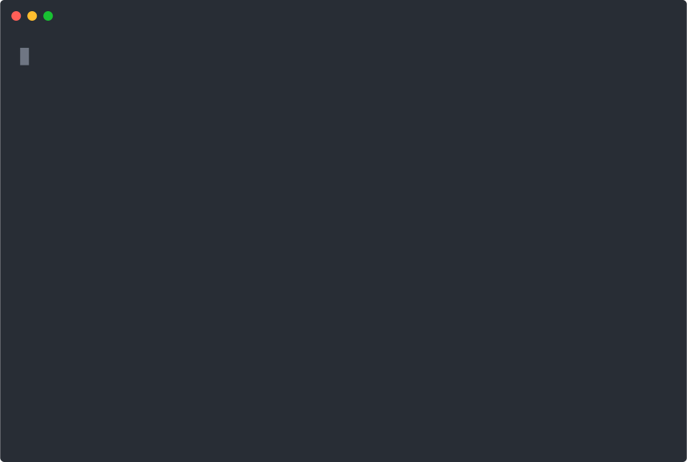

# Plantillas en CliFire

El módulo `Template` de CliFire permite renderizar y guardar archivos usando plantillas basadas en [Jinja2](https://jinja.palletsprojects.com/). Esta funcionalidad te ayuda a generar contenido dinámico de manera sencilla, ideal para crear archivos de configuración, reportes u otros documentos que requieran personalización.

Puede usar el módulo `Template` de manera independiente, o puede usarlo dentro de la clase `App` para manejar la configuración de su aplicación CLI.

El fichero `sample_template/hello.jinja2` es un ejemplo de plantilla que se puede usar con el módulo `Template`. Aquí tienes un ejemplo de cómo se vería el contenido de la plantilla:

```jinja2
<h1>{{ title }}</h1>
<ul>
    
        <li>{{ number }}</li>
    
</ul>
```

El comando CLI se llamará `app_template.py` y se verá así:
```python
from clifire import application, command, out


class HelloCommand(command.Command):
    _name = "hello"
    _help = "Create template"

    title = command.Field(
        pos=1,
        force_type=str,
    )

    def fire(self):
        print(self.title)
        content = self.app.template.render(
            'hello.jinja2', title=self.title, numbers=[1, 2, 3])
        out.success(content)


def main():
    app = application.App(template_folder="./sample_template")
    app.add_command(HelloCommand)
    app.fire()


if __name__ == "__main__":
    main()

```
Con esto al ejecutarlo tendrás un comando que renderiza la plantilla `hello.jinja2` con el título y una lista de números, mostrando el resultado en la terminal.




## Funciones Principales

- **`Template.render(template: str, **args) -> str`**
  Renderiza una plantilla especificada. Recibe el nombre del archivo de plantilla y parámetros adicionales que se utilizarán para sustituir las variables definidas en la plantilla.

  Ejemplo:
  ```python
  from clifire import template

  # Crea el objeto Template especificando la carpeta donde se encuentran las plantillas.
  tpl = template.Template("templates")
  content = tpl.render("sample.jinja2", title="My Title", user="admin", items=["one", "two"])

  # 'content' contendrá el HTML generado con los valores proporcionados.
  print(content)
  ```

- **`Template.write(template: str, filename: str, mark: Optional[str] = None, **args) -> str`**
  Renderiza la plantilla y guarda su contenido en un fichero.
  Si se especifica un parámetro `mark`, el contenido renderizado se insertará o se reemplazará entre marcas especiales en el fichero; esto es útil para actualizar secciones específicas sin sobrescribir el resto del contenido.

  Ejemplo sin marca:
  ```python
  tpl = template.Template("templates")
  rendered = tpl.write("sample.jinja2", "output.html", title="My Title", user="admin", items=["one", "two"])
  ```

  Ejemplo con marca:
  ```python
  tpl = template.Template("templates")
  # El marcado '<<CONTENT>>' delimitará la sección a actualizar.
  rendered = tpl.write("sample.jinja2", "output.html", mark="<<CONTENT>>", title="My Title", user="admin", items=["one", "two"])
  ```

## ¿Cómo Funciona?

1. **Renderizado de Plantillas:**
   El método `render` carga el archivo de plantilla utilizando Jinja2 y lo procesa con los argumentos proporcionados. Esto te permite generar contenido dinámico basado en variables definidas en tu plantilla.

2. **Guardado y Actualización de Archivos:**
   Con el método `write`, puedes almacenar directamente el contenido renderizado en un fichero.
   Si especificas un `mark`:
   - El método busca dentro del fichero la sección delimitada por esa marca.
   - Si encuentra la sección, la reemplaza con el nuevo contenido renderizado.
   - Si no existe, añade la sección al final del fichero.
   Esto permite actualizar partes específicas del fichero sin perder el contenido original que se encuentre fuera de las marcas.

3. **Integración Dinámica:**
   El objeto `Template` se integra con el resto de CliFire, permitiéndote utilizar variables de entorno o cualquier otra lógica de negocio durante el renderizado.

## Ejemplo Completo

```python
from clifire import template

def generate_report():
    # Inicializa la plantilla indicando la carpeta de plantillas
    tpl = template.Template("templates")

    # Renderiza la plantilla sample.jinja2 con datos dinámicos
    content = tpl.render("sample.jinja2", title="Report", user="admin", items=["Item 1", "Item 2", "Item 3"])
    print("Rendered Content:")
    print(content)

    # Guarda el contenido renderizado en output.html sin usar marcas
    tpl.write("sample.jinja2", "output.html", title="Report", user="admin", items=["Item 1", "Item 2", "Item 3"])

    # Guarda el contenido en output_marked.html utilizando una marca para actualizar solo una sección
    tpl.write("sample.jinja2", "output_marked.html", mark="<<CONTENT>>", title="Report", user="admin", items=["Item 1", "Item 2", "Item 3"])

if __name__ == "__main__":
    generate_report()
```

## Conclusión

El módulo `Template` permite separar la lógica del contenido de la presentación, facilitando la generación de ficheros dinámicos a partir de plantillas. Esto mejora la mantenibilidad y la flexibilidad de tus aplicaciones CLI, permitiéndote actualizar secciones específicas de un fichero sin afectar el resto del contenido.

Esta funcionalidad es especialmente útil para proyectos que requieran la creación o actualización periódica de reportes, ficheros de configuración, o cualquier otro tipo de documento basado en plantillas.
